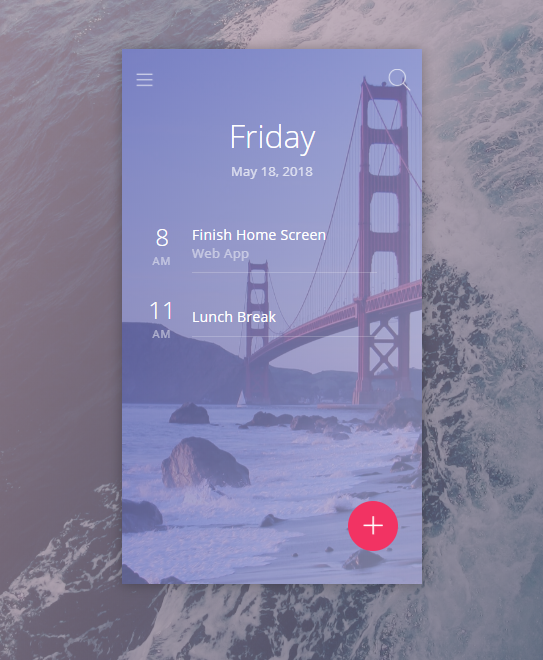

## Introduction
A daily planner todolist type web app built using React and Redux.

## Installation
1. npm install
2. npm start

## Description
This is a day planner app that has the functionality of a todolist app. You can add new plans along with when they are due or when you should start them. You can also attach a memo to describe the plan that you want to add.

The app was built with React and Redux. Redux was used to manage the business state of the app while React state was used to manage the UI state such as animations, hiding and showing boxes, etc.

Technologies: HTML, CSS, JavaScript, ReactJS, Redux# Daily-Planner
